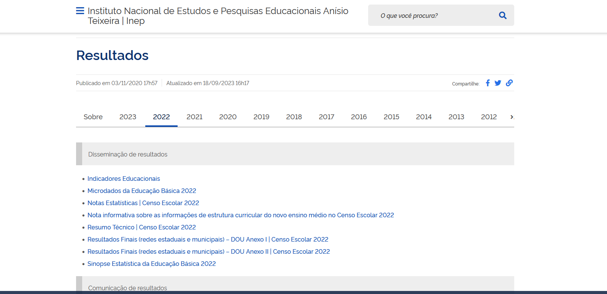
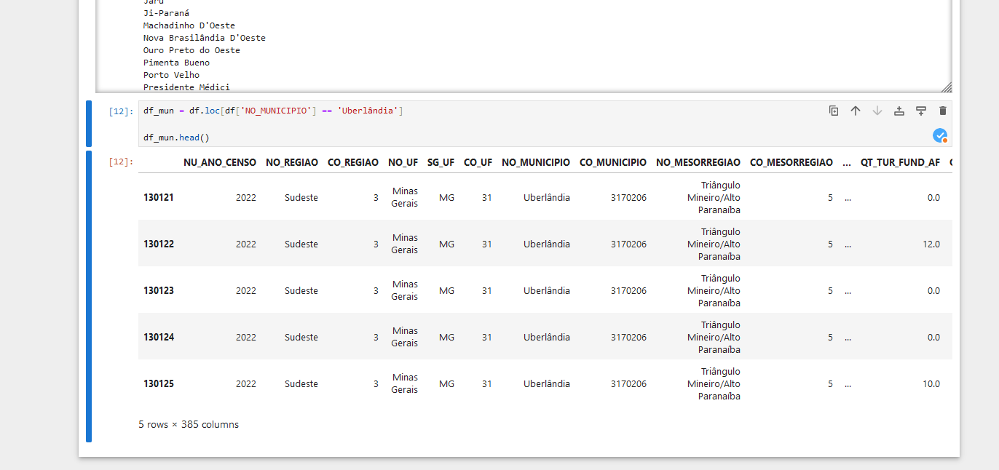

## Parte 2 - Levantamento e tratamento dos dados

### 2.a Adquirindo os dados

Os dados utilizados nessa oficina foram obtidos no site do INEP (Instituto Nacional de Estudos e Pesquisas Educacionais Anísio Teixeira), que é uma autarquia federal vinculada ao Ministério da Educação (MEC). O INEP é responsável pela coleta, análise e divulgação de informações sobre a educação brasileira.
Para acessa-los basta clicar no link abaixo: 

[INEP - Acessar Microdados ](https://www.gov.br/inep/pt-br/areas-de-atuacao/pesquisas-estatisticas-e-indicadores/censo-escolar/resultados)



O arquivo zip baixado contém 3 subpastas. São elas:

1. Anexos: Que contém o dicionário de dados, que é um documento que descreve os dados contidos no arquivo.
2. Dados: Que contém os dados propriamente ditos, em formato CSV.
3. Leia-me: Que contém um arquivo de texto com instruções para a leitura dos dados.


Para nós, o mais importante é a pasta Dados, que contém os dados em formato CSV. CSV é um formato de arquivo de texto simples que armazena dados em uma tabela, com **cada linha representando uma linha da tabela e cada coluna representando uma coluna da tabela.** Os dados são separados por vírgulas, daí o nome "CSV" (valores separados por vírgula). Além disso, os **Anexos** ajudam a entender o significado de cada coluna.

É possível abrir o arquivo CSV em uma planilha, como o Microsoft Excel ou o Google Sheets. Para isso, basta abrir o arquivo CSV em uma planilha e os dados serão exibidos em uma tabela. No entanto, arquivos pesados podem travar o Excel ou o Sheets. Além disso, esses programas não são adequados para análise de dados, pois não oferecem recursos de análise de dados avançados. 

No nosso caso, o arquivo csv possui 125mb, o que é um tamanho considerável. Por isso, utilizaremos o Python para ler e analisar os dados, por meio da biblioteca Pandas.

### 2.b Entendendo os dados

Primeiramente, vou abrir o arquivo *dicionário_dados_educação_básica.xlsx* para entender o significado de cada coluna e ter uma visão geral dos dados.
O arquivo fica localizado em: 
``` INEP\Anexos\ANEXO I...\dicionário_dados_educação_básica.xlsx ```

Uma leitura rápida me indica que existem cerca de 400 colunas. Ou seja, existem muitas informações que podem ser retiradas desse arquivo, incluindo a localização (endereço), número de alunos, número de professores, número de salas de aula etc.

### 2.c Abrindo o arquivo CSV com Pandas

Agora, vamos abrir o arquivo CSV com a biblioteca Pandas. Para isso, abra o prompt de comando e digite:

```python```

*Importar a biblioteca Pandas e renomeá-la como pd*

```import pandas as pd```

*Abrir o arquivo CSV e armazená-lo em um DataFrame chamado df. Para isso, usamos a função read_csv() da biblioteca pandas. Os argumentos da função são o caminho do arquivo CSV (ajustar para o seu), o separador de colunas (sep) e o tipo de codificação (encoding). Como o arquivo é grande, usamos o low_memory=False para permitir que os dados sejam lidos* 
ps. O caminho do arquivo deve ser ajustado para o seu computador e usar / ao invés de \.

```df = pd.read_csv('C:/Users/.../ESCOLAS.CSV', delimiter=';', encoding='iso-8859-1', low_memory=False)```

*Exibir as primeiras 5 linhas do DataFrame*

```df.head()```

Vamos fazer um teste no *jupyter* para ver se está tudo funcionando. 


Deu certo! Agora vamos para a próxima etapa.

### 2.d Selecionando e salvando o município de interesse

Agora, vamos selecionar apenas as escolas do município de interesse. Para isso, vamos usar a coluna "Município" do DataFrame. Primeiro, vamos ver quais municípios estão presentes no DataFrame. Para isso, usamos a função unique() da biblioteca Pandas.

    df_mun = df['NO_MUNICIPIO'].unique()

    for val in df_mun:
        print(val)

Aqui parece um pouco mais complicado, mas não é. o df_mun é uma variável definida a partir do resultado da função df.unique. Ou seja, ela é uma lista com todos os municípios presentes no DataFrame. 
Já o **for** é um laço de repetição, que vai percorrer todos os valores da lista df_mun e imprimir na tela. Em outras palavras: Ele vai pegar valor por valor da lista df_mun e imprimir na tela.

Como o número de municípios é muito grande, você deve ter reparado, o código acima não é muito útil. Mas ele permite identificar o nome correto da cidade utilizado. Por isso, vamos selecionar apenas o município de interesse. Para isso, vamos usar a função loc() da biblioteca Pandas. 

    df_mun = df.loc[df['NO_MUNICIPIO'] == 'Uberlândia']

    df_mun.head()



Agora que temos apenas os dados de Uberlândia, podemos começar a trabalhar com eles. Vamos começar salvando os dados em um arquivo .CSV único para Uberlandia. Assim, não precisamos rodar o código acima toda vez que quisermos trabalhar com os dados de Uberlândia.

Para isso, usamos a função to_csv() da biblioteca Pandas. Os argumentos da função são o caminho do arquivo CSV (ajustar para o seu), o separador de colunas (delimiter) e o tipo de codificação (encoding). Além disso, usamos o argumento index=False para não salvar o índice do DataFrame no arquivo CSV.

    df_mun.to_csv('C:/Users/.../ESCOLAS_UBERLANDIA.CSV', sep=';', encoding='iso-8859-1', index=False)

O arquivo novo agora tem apenas 585kb, sendo mais fácil de trabalhar com ele.


### 2.e Explorando os dados

Agora que temos apenas os dados de Uberlândia, podemos começar a explorá-los. Vamos começar com uma análise simples, que é contar quantas escolas existem em Uberlândia. Para isso, usamos a função count() da biblioteca Pandas.

    df_mun['CO_ENTIDADE'].count()

Nesse caso usamos a coluna CO_ENTIDADE, que é o código da escola. Como cada escola tem um código único, podemos contar quantas escolas existem em Uberlândia contando quantos códigos existem.

E se quisermos saber quantas escolas são publicas (federal, estadual e municipal) e quantas sao privadas? Para isso, usamos a função value_counts() da biblioteca Pandas. No caso, a tabela do INEP usa os seguintes códigos para identificar o tipo de escola: 1-Federal, 2-Estadual, 3-Municipal, 4-Privada

    df_mun['TP_DEPENDENCIA'].value_counts()

Podemos também identificar qual o tipo de ensino oferecido pelas escolas. Por exemplo, queremos saber quantas escolas possuem ensino Educação Básica (Nao profissionalizante). Para isso, usamos a função value_counts() da biblioteca Pandas. No caso, a tabela do INEP usa os seguintes códigos para identificar se a escola possui ensino básico: 1-Sim, 2-Não

    df_mun['IN_BAS'].value_counts()


Já conseguimos informações importantes, veja na imagem abaixo:


Agora, vamos fazer uma análise mais complexa. Vamos analisar a quantidade de alunos por escola. Para isso, usamos a função groupby() da biblioteca Pandas. Os argumentos da função são a coluna que queremos agrupar (no caso, CO_ENTIDADE) e a função que queremos aplicar (no caso, sum() para somar os valores). queremos somar as colunas QT_MAT_BAS, QT_MAT_PROF, QT_MAT_PROF_TEC, QT_MAT_EJA. A coluna nova sera chama te QT_ALUNOS_TOTAL:
Antes vamos criar uma lista com as colunas que queremos somar:

    colunas = ['QT_MAT_BAS', 'QT_MAT_PROF', 'QT_MAT_PROF_TEC', 'QT_MAT_EJA']
    
Agora vamos somar as colunas e criar uma nova coluna chamada QT_ALUNOS_TOTAL:

    df_mun['QT_ALUNOS_TOTAL'] = df_mun[colunas].sum(axis=1)

Vamos ver a quantidade de alunos na **ESCOLA DE EDUCACAO BASICA DA UFU**. Se quisermos ver apenas a coluna da soma:
    
    df_mun.loc[df_mun['CO_ENTIDADE'] == 31166545]['QT_ALUNOS_TOTAL']

**Pronto, agora já fizemos uma boa exploração inicial. Vamos salvar os dados com a coluna nova em um novo arquivo .CSV**

    df_mun.to_csv('C:/Users/.../ESCOLAS_UBERLANDIA_PARTE_2.CSV')


### 2.f Última verificação

Agora que temos os dados já selecionados para Uberlandia e fizemos uma rápida exploração, vamos verificar novamente as variáveis que temos disponíveis. Para isso, vamos abrir o arquivo *dicionário_dados_educação_básica.xlsx* para entender o significado de cada coluna e ter uma visão geral dos dados.

Ao analisar as variáveis, observamos que uma das variáveis corresponde à **Situação de funcionamento** das escolas. Ou seja, ela indica se uma escola está em funcionamento, paralisada, extinta no ano do censo, ou extinta em anos anteriores. Para o nosso estudo, é importante saber os dados das escolas que estão em funcionamento. Primeiro, vamos contar quantas escolas estão em funcionamento. Para isso, usamos a função value_counts() da biblioteca Pandas. No caso, a tabela do INEP usa os seguintes códigos para identificar a situação de funcionamento: 1-Em atividade, 2-Paralisada, 3-Extinta no ano do censo, 4-Extinta em anos anteriores

    df_mun['TP_SITUACAO_FUNCIONAMENTO'].value_counts()

Como podemos observar, existem escolas que estão paralisadas ou extintas. Para o nosso estudo, vamos considerar apenas as escolas que estão em funcionamento. Para isso, vamos criar um novo DataFrame chamado df_mun_func com apenas as escolas que estão em funcionamento. Para isso, usamos a função loc() da biblioteca Pandas.

    df_mun_func = df_mun.loc[df_mun['TP_SITUACAO_FUNCIONAMENTO'] == 1]

Agora, vamos verificar novamente quantas escolas existem em Uberlândia. Para isso, usamos novamente a função value_counts() da biblioteca Pandas.

    df_mun_func['TP_SITUACAO_FUNCIONAMENTO'].value_counts()

Agora sim, temos um Dataframe limpo. Vamos salva-lo em um novo arquivo .CSV

    df_mun_func.to_csv('C:/Users/.../NOME_DO_ARQUIVO.CSV')