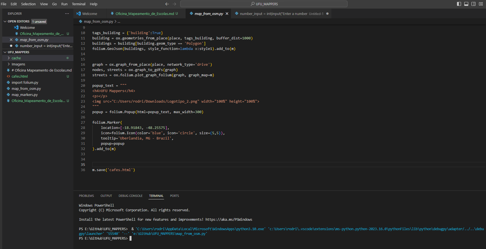
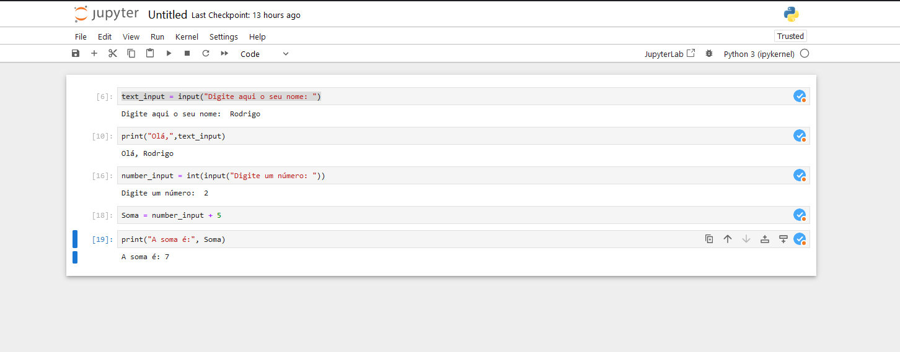
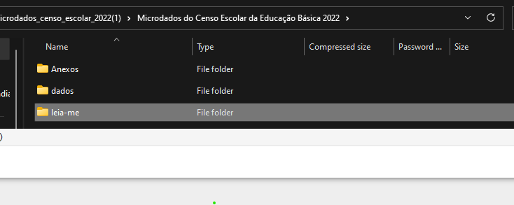
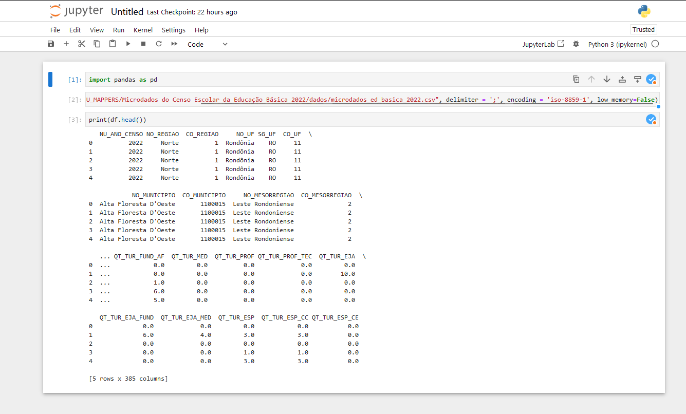
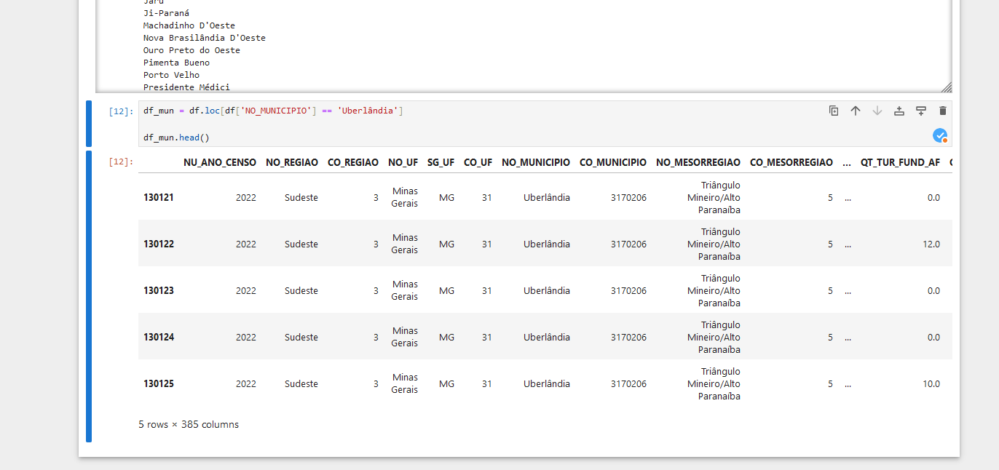
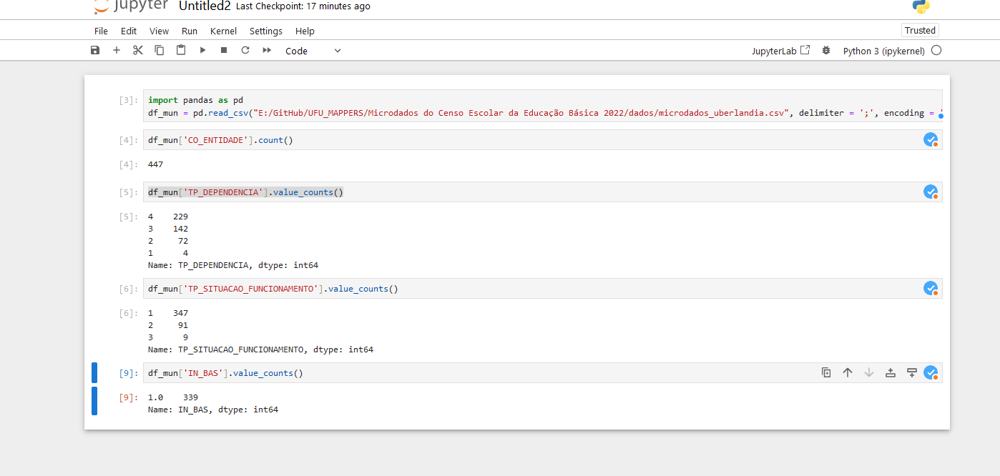

# Oficina Mapeamento de Escolas - UFUMappers


## Parte 1 - Instalação do Python e das bibliotecas a serem utilizadas

### 1.a O que é Python (linguagem de programação)?

Python é uma linguagem de programação, ou seja, uma ferramenta que os computadores entendem para realizar tarefas específicas. Mas, ao contrário de outras linguagens de programação que podem parecer complexas, Python é conhecida por sua simplicidade e legibilidade.

Imagine Python como uma linguagem que você usa para dar instruções a um computador. Em vez de usar palavras difíceis de entender, você escreve comandos em Python que são parecidos com a linguagem humana.

### 1.b O que são bibliotecas em programação?

Imagine que você está construindo uma casa a partir do zero, e você precisa fazer todas as peças, como portas, janelas, encanamento, fiação elétrica e muito mais, do zero. Isso seria um trabalho extremamente demorado e complicado.

Agora, pense em programação da mesma maneira. Quando você está escrevendo um programa de computador, às vezes precisa realizar tarefas complexas, como criar gráficos, realizar cálculos matemáticos avançados ou até mesmo interagir com a internet. Em vez de escrever todo o código do zero para realizar essas tarefas, você pode usar "bibliotecas".

Bibliotecas são conjuntos de código pré-escrito que contêm funções, classes e métodos para realizar tarefas específicas. Elas são como kits de ferramentas que programadores podem usar para economizar tempo e esforço. As bibliotecas são criadas por outros programadores e estão disponíveis gratuitamente ou através de licenças específicas.

Por exemplo, se você estiver programando em Python e precisar criar gráficos, pode usar a biblioteca matplotlib, que fornece todas as ferramentas necessárias para criar gráficos bonitos sem escrever o código do zero. Se precisar fazer solicitações à web, a biblioteca requests simplifica essa tarefa.

O uso de bibliotecas economiza tempo e torna a programação mais eficiente, permitindo que os desenvolvedores se concentrem em resolver os problemas específicos do projeto em vez de reinventar a roda a cada vez que enfrentam uma tarefa comum.

```Em resumo, bibliotecas em programação são como caixas de ferramentas cheias de funcionalidades prontas para uso, que os programadores podem incorporar em seus projetos para realizar tarefas específicas sem escrever todo o código do zero. Isso ajuda a tornar o desenvolvimento de software mais rápido e eficiente.```

Agora, como instalar o Python e suas bibliotecas:

### 1.c Instalando o Python e suas bibliotecas

**Baixando o Python:**

A primeira coisa que você precisa fazer é baixar o Python em seu computador. Para isso, siga os passos abaixo:

- Acesse o site oficial do Python em python.org.
- Clique na versão mais recente do Python, que será exibida na página inicial.
- Escolha o instalador apropriado para o seu sistema operacional (Windows, macOS ou Linux) e faça o download.
- Abra o arquivo de instalação baixado e siga as instruções na tela para instalar o Python em seu computador.

**Verificando a instalação:** 

Após a instalação, você pode verificar se o Python foi instalado corretamente. Abra o prompt de comando (no Windows) ou o terminal (no macOS e Linux) e digite o seguinte comando:

    python (ENTER)

    python --version

Isso deve exibir a versão do Python que você instalou, confirmando que a instalação foi bem-sucedida.

### 1.d Instalando as bibliotecas que serão utilizadas.

O Python é permite que você use bibliotecas, que são conjuntos de código pré-escritos para realizar tarefas específicas. Para instalar bibliotecas, você pode usar uma ferramenta chamada pip, que é o gerenciador de pacotes do Python. 
Em princípio, utilizaremos três bibliotecas principais. São elas
* Pandas:  biblioteca Python para análise de dados.
* Matplotlib: biblioteca Python para criação de gráficos e visualizações.
* Folium: biblioteca Python que facilita a criação de mapas interativos e visualizações geoespaciais.
* Numpy: biblioteca Python para cálculos matemáticos.
   
Aqui está como você pode instalar uma biblioteca, por exemplo, a biblioteca matplotlib para criar gráficos:

Abra o prompt de comando ou o terminal e digite:

```pip install matplotlib```

*O pip baixará e instalará a biblioteca matplotlib em seu sistema. Você pode fazer isso para qualquer biblioteca Python que você precise* 

```pip install pandas```
```pip install folium```
```pip install numpy```

### 1.e Ambientes de desenvolvimento
Um ambiente de desenvolvimento, comumente chamado de "IDE" (Ambiente de Desenvolvimento Integrado) ou "IDE de Desenvolvimento", é uma ferramenta de software projetada para auxiliar programadores e desenvolvedores em várias etapas do processo de criação de software. Ele fornece um conjunto de recursos e ferramentas integradas que tornam mais fácil e eficiente escrever, depurar e gerenciar código de programação

**Exemplos de IDEs** 
IDLE (Python IDLE):

    IDLE é o ambiente de desenvolvimento integrado padrão que acompanha a instalação do Python.
    É simples, leve e fácil de usar, adequado para iniciantes.
    Oferece recursos básicos de edição de código, execução de scripts e depuração.

Thonny:

    Thonny é um ambiente Python especialmente projetado para iniciantes.
    É leve e fácil de usar, com uma interface intuitiva.
    Oferece recursos de edição de código, depuração e gerenciamento de pacotes.

Visual Studio Code (VS Code) com extensões Python:

    O VS Code é um editor de código altamente personalizável e leve.
    Você pode adicionar extensões Python, como "Python" da Microsoft, para transformá-lo em um ambiente Python completo.
    Ele oferece suporte a depuração, gerenciamento de pacotes e integração com Git.




Sublime Text com extensões Python:

    O Sublime Text é um editor de texto altamente configurável e leve.
    Você pode adicionar pacotes e extensões específicos do Python para habilitar recursos de desenvolvimento Python.
    É amplamente utilizado por desenvolvedores que apreciam sua velocidade e simplicidade.


**Uma outra alternativa** 
No lugar nos IDEs, podemos também utilizar o  *Jupyter*, uma aplicação web de código aberto que permite criar e compartilhar documentos interativos, chamados de *notebooks*. Ele é amplamente usado porque permite combinar código, texto explicativo, visualizações e outros elementos em um único documento interativo.
Para usa-lo é necessário realizar uma instalação, assim como fizemos com as bibliotecas.

Abra o prompt de comando e digite:
```pip install jupyter```

A instalação irá rodar e, em seguida, estará pronta para ser utilizada.

Para rodar o *jupyter* basta digitar no prompt de comando

```jupyter notebook```




Um possível erro é quando o sistema não identifica a instalação do *Jupyter*. Nesse caso, é preciso corrigir o PATH do sistema. Além disso, também é possível que o sistema não consiga abrir o *notebook*, ou seja, o *Jupyter* é encontrado porém não é possível abrir um localhost. Para corrigir esses problemas, leia o item **Observações** ao final do texto

**Pronto, agora você já tem o Python e as bibliotecas instaladas e finalmente podemos começar!!**


## Parte 2 - Levantamento e tratamento dos dados

### 2.a Adquirindo os dados

Os dados utilizados nessa oficina foram obtidos no site do INEP (Instituto Nacional de Estudos e Pesquisas Educacionais Anísio Teixeira), que é uma autarquia federal vinculada ao Ministério da Educação (MEC). O INEP é responsável pela coleta, análise e divulgação de informações sobre a educação brasileira.
Para acessa-los basta clicar no link abaixo: 

[INEP - Acessar Microdados ](https://www.gov.br/inep/pt-br/areas-de-atuacao/pesquisas-estatisticas-e-indicadores/censo-escolar/resultados)


O arquivo zip baixado contém 3 subpastas. São elas:

1. Anexos: Que contém o dicionário de dados, que é um documento que descreve os dados contidos no arquivo.
2. Dados: Que contém os dados propriamente ditos, em formato CSV.
3. Leia-me: Que contém um arquivo de texto com instruções para a leitura dos dados.



Para nós, o mais importante é a pasta Dados, que contém os dados em formato CSV. CSV é um formato de arquivo de texto simples que armazena dados em uma tabela, com **cada linha representando uma linha da tabela e cada coluna representando uma coluna da tabela.** Os dados são separados por vírgulas, daí o nome "CSV" (valores separados por vírgula). Além disso, os **Anexos** ajudam a entender o significado de cada coluna.

É possível abrir o arquivo CSV em uma planilha, como o Microsoft Excel ou o Google Sheets. Para isso, basta abrir o arquivo CSV em uma planilha e os dados serão exibidos em uma tabela. No entanto, arquivos pesados podem travar o Excel ou o Sheets. Além disso, esses programas não são adequados para análise de dados, pois não oferecem recursos de análise de dados avançados. 

No nosso caso, o arquivo csv possui 125mb, o que é um tamanho considerável. Por isso, utilizaremos o Python para ler e analisar os dados, por meio da biblioteca Pandas.

### 2.b Entendendo os dados

Primeiramente, vou abrir o arquivo *dicionário_dados_educação_básica.xlsx* para entender o significado de cada coluna e ter uma visão geral dos dados.
O arquivo fica localizado em: 
``` INEP\Anexos\ANEXO I...\dicionário_dados_educação_básica.xlsx ```

Uma leitura rápida me indica que existem cerca de 400 colunas. Ou seja, existem muitas informações que podem ser retiradas desse arquivo, incluindo a localização (endereço), número de alunos, número de professores, número de salas de aula etc.

### 2.c Abrindo o arquivo CSV com Pandas

Agora, vamos abrir o arquivo CSV com a biblioteca Pandas. Para isso, abra o prompt de comando e digite:

```python```

*Importar a biblioteca Pandas e renomeá-la como pd*

```import pandas as pd```

*Abrir o arquivo CSV e armazená-lo em um DataFrame chamado df. Para isso, usamos a função read_csv() da biblioteca pandas. Os argumentos da função são o caminho do arquivo CSV (ajustar para o seu), o separador de colunas (sep) e o tipo de codificação (encoding). Como o arquivo é grande, usamos o low_memory=False para permitir que os dados sejam lidos* 
ps. O caminho do arquivo deve ser ajustado para o seu computador e usar / ao invés de \.

```df = pd.read_csv('C:/Users/.../ESCOLAS.CSV', delimiter=';', encoding='iso-8859-1', low_memory=False)```

*Exibir as primeiras 5 linhas do DataFrame*

```df.head()```

Vamos fazer um teste no *jupyter* para ver se está tudo funcionando. 


Deu certo! Agora vamos para a próxima etapa.

### 2.d Selecionando e salvando o município de interesse

Agora, vamos selecionar apenas as escolas do município de interesse. Para isso, vamos usar a coluna "Município" do DataFrame. Primeiro, vamos ver quais municípios estão presentes no DataFrame. Para isso, usamos a função unique() da biblioteca Pandas.

    df_mun = df['NO_MUNICIPIO'].unique()

    for val in df_mun:
        print(val)

Aqui parece um pouco mais complicado, mas não é. o df_mun é uma variável definida a partir do resultado da função df.unique. Ou seja, ela é uma lista com todos os municípios presentes no DataFrame. 
Já o **for** é um laço de repetição, que vai percorrer todos os valores da lista df_mun e imprimir na tela. Em outras palavras: Ele vai pegar valor por valor da lista df_mun e imprimir na tela.

Como o número de municípios é muito grande, você deve ter reparado, o código acima não é muito útil. Mas ele permite identificar o nome correto da cidade utilizado. Por isso, vamos selecionar apenas o município de interesse. Para isso, vamos usar a função loc() da biblioteca Pandas. 

    df_mun = df.loc[df['NO_MUNICIPIO'] == 'Uberlândia']

    df_mun.head()



Agora que temos apenas os dados de Uberlândia, podemos começar a trabalhar com eles. Vamos começar salvando os dados em um arquivo .CSV único para Uberlandia. Assim, não precisamos rodar o código acima toda vez que quisermos trabalhar com os dados de Uberlândia.

Para isso, usamos a função to_csv() da biblioteca Pandas. Os argumentos da função são o caminho do arquivo CSV (ajustar para o seu), o separador de colunas (delimiter) e o tipo de codificação (encoding). Além disso, usamos o argumento index=False para não salvar o índice do DataFrame no arquivo CSV.

    df_mun.to_csv('C:/Users/.../ESCOLAS_UBERLANDIA.CSV', sep=';', encoding='iso-8859-1', index=False)

O arquivo novo agora tem apenas 585kb, sendo mais fácil de trabalhar com ele.


### 2.e Explorando os dados

Agora que temos apenas os dados de Uberlândia, podemos começar a explorá-los. Vamos começar com uma análise simples, que é contar quantas escolas existem em Uberlândia. Para isso, usamos a função count() da biblioteca Pandas.

    df_mun['CO_ENTIDADE'].count()

Nesse caso usamos a coluna CO_ENTIDADE, que é o código da escola. Como cada escola tem um código único, podemos contar quantas escolas existem em Uberlândia contando quantos códigos existem.

E se quisermos saber quantas escolas são publicas (federal, estadual e municipal) e quantas sao privadas? Para isso, usamos a função value_counts() da biblioteca Pandas. No caso, a tabela do INEP usa os seguintes códigos para identificar o tipo de escola: 1-Federal, 2-Estadual, 3-Municipal, 4-Privada

    df_mun['TP_DEPENDENCIA'].value_counts()

Podemos também identificar qual o tipo de ensino oferecido pelas escolas. Por exemplo, queremos saber quantas escolas possuem ensino Educação Básica (Nao profissionalizante). Para isso, usamos a função value_counts() da biblioteca Pandas. No caso, a tabela do INEP usa os seguintes códigos para identificar se a escola possui ensino básico: 1-Sim, 2-Não

    df_mun['IN_BAS'].value_counts()


Já conseguimos informações importantes, veja na imagem abaixo:



Agora, vamos fazer uma análise mais complexa. Vamos analisar a quantidade de alunos por escola. Para isso, usamos a função groupby() da biblioteca Pandas. Os argumentos da função são a coluna que queremos agrupar (no caso, CO_ENTIDADE) e a função que queremos aplicar (no caso, sum() para somar os valores). queremos somar as colunas QT_MAT_BAS, QT_MAT_PROF, QT_MAT_PROF_TEC, QT_MAT_EJA. A coluna nova sera chama te QT_ALUNOS_TOTAL:
Antes vamos criar uma lista com as colunas que queremos somar:

    colunas = ['QT_MAT_BAS', 'QT_MAT_PROF', 'QT_MAT_PROF_TEC', 'QT_MAT_EJA']
    
Agora vamos somar as colunas e criar uma nova coluna chamada QT_ALUNOS_TOTAL:

    df_mun['QT_ALUNOS_TOTAL'] = df_mun[colunas].sum(axis=1)

Vamos ver a quantidade de alunos na **ESCOLA DE EDUCACAO BASICA DA UFU**. Se quisermos ver apenas a coluna da soma:
    
    df_mun.loc[df_mun['CO_ENTIDADE'] == 31166545]['QT_ALUNOS_TOTAL']

**Pronto, agora já fizemos uma boa exploração inicial. Vamos salvar os dados com a coluna nova em um novo arquivo .CSV**

    df_mun.to_csv('C:/Users/.../ESCOLAS_UBERLANDIA_PARTE_2.CSV')


### 2.f Última verificação

Agora que temos os dados já selecionados para Uberlandia e fizemos uma rápida exploração, vamos verificar novamente as variáveis que temos disponíveis. Para isso, vamos abrir o arquivo *dicionário_dados_educação_básica.xlsx* para entender o significado de cada coluna e ter uma visão geral dos dados.

Ao analisar as variáveis, observamos que uma das variáveis corresponde à **Situação de funcionamento** das escolas. Ou seja, ela indica se uma escola está em funcionamento, paralisada, extinta no ano do censo, ou extinta em anos anteriores. Para o nosso estudo, é importante saber os dados das escolas que estão em funcionamento. Primeiro, vamos contar quantas escolas estão em funcionamento. Para isso, usamos a função value_counts() da biblioteca Pandas. No caso, a tabela do INEP usa os seguintes códigos para identificar a situação de funcionamento: 1-Em atividade, 2-Paralisada, 3-Extinta no ano do censo, 4-Extinta em anos anteriores

    df_mun['TP_SITUACAO_FUNCIONAMENTO'].value_counts()

Como podemos observar, existem escolas que estão paralisadas ou extintas. Para o nosso estudo, vamos considerar apenas as escolas que estão em funcionamento. Para isso, vamos criar um novo DataFrame chamado df_mun_func com apenas as escolas que estão em funcionamento. Para isso, usamos a função loc() da biblioteca Pandas.

    df_mun_func = df_mun.loc[df_mun['TP_SITUACAO_FUNCIONAMENTO'] == 1]

Agora, vamos verificar novamente quantas escolas existem em Uberlândia. Para isso, usamos novamente a função value_counts() da biblioteca Pandas.

    df_mun_func['TP_SITUACAO_FUNCIONAMENTO'].value_counts()

Agora sim, temos um Dataframe limpo. Vamos salva-lo em um novo arquivo .CSV

    df_mun_func.to_csv('C:/Users/.../NOME_DO_ARQUIVO.CSV')


## Parte 3 - Visualizando os dados

### 3.a Verificando a instalação dos dados

Agora que temos os dados melhor organizados. Vamos começar a visualizá-los. Para isso, vamos usar a biblioteca matplotlib. A biblioteca matplotlib é uma biblioteca Python para criação de gráficos e visualizações. 
Vamos ver se as bibliotecas que precisamos já estão instaladas. Para isso, abra o prompt de comando e digite:

    pip list

Se as bibliotecas matplotlib e numpy não estiverem instaladas, instale-as com os seguintes comandos:
    
        pip install matplotlib
        pip install numpy

Com as bibliotecas instaladas podemos prosseguir com a visualização dos dados.

### 3.b Gerando a primeira visualização

Agora vamos abrir o nosso IDE ou o Jupyter notebook.

O primeiro passo é importar a biblioteca matplotlib e renomeá-la como plt. Além disso, vamos importar a biblioteca numpy e renomeá-la como np. A biblioteca numpy é uma biblioteca Python para cálculos matemáticos. 
Obs.*A renomeação é opcional, mas é uma prática comum para economizar tempo e digitação.*

    import matplotlib.pyplot as plt
    import numpy as np


Após importar as bibliotecas, iniciaremos nosso código abrindo a base de dados que tratamos anteriormente.
    
        df_mun = pd.read_csv('C:/Users/.../ESCOLAS_UBERLANDIA_PARTE_2.CSV', delimiter=';', encoding='latin')

Vamos supor que você tenha um DataFrame chamado 'df_mun' com a coluna 'TP_DEPENDENCIA' que contém as classificações das escolas.

Agora, vamos criar uma lista com os valores únicos da coluna 'TP_DEPENDENCIA' e armazená-la na variável 'labels'. Para isso, usamos a função unique() da biblioteca Pandas.

    labels = df_mun['TP_DEPENDENCIA'].unique()

Agora, vamos criar uma lista com a quantidade de escolas de cada tipo e armazená-la na variável 'sizes'. Para isso, usamos a função value_counts() da biblioteca Pandas.

    contagem_escolas = df_mun['TP_DEPENDENCIA'].value_counts()

Agora, vamos criar uma lista com as cores que queremos usar e armazená-la na variável 'colors'. Existem diversar formas de definir as cores do gráfico. No caso, adotaremos o nome das cores que está definido da documentação do matplotlib. Para mais informações, acesse o link abaixo:

[Documentação cores](https://matplotlib.org/2.1.1/gallery/color/named_colors.html#sphx-glr-gallery-color-named-colors-py)

No caso, escolhi 4 cores, visto que temos 4 tipos de escolas. Portanto, criaremos uma variável chamada 'colors' com 4 cores.

    colors = ['skyblue', 'lightgreen', 'lightcoral', 'orange']


Já podemos gerar nosso gráfico. Começamos criando uma figura (plt.figure) e definimos o seu tamanho:
    
    plt.figure(figsize=(8, 6))

Agora, vamos criar o gráfico de barra vertical. Para isso, usamos a função bar() da biblioteca matplotlib. Os argumentos da função são a lista com os valores únicos da coluna 'TP_DEPENDENCIA' (labels), a lista com a quantidade de escolas de cada tipo (sizes) e a lista com as cores que queremos usar (colors).

    plt.bar(labels, sizes, color=colors)

No nosso caso 
    plt.bar(tipos_escolas, quantidade_escolas, color=['skyblue', 'lightgreen', 'lightcoral', 'orange'])


Em seguida, definimos os rótulos e títulos
    plt.xlabel('Tipo de escola')
    plt.ylabel('Quantidade de Escolas')
    plt.title('Distribuição de Escolas por Tipo de Dependência')

Definimos os rótulos no eixo x usando xticks: 

    print([mapeamento_tipos_escolas[tipo_escola] for tipo_escola in tipos_escolas])
    plt.xticks(tipos_escolas, [mapeamento_tipos_escolas[tipo_escola] for tipo_escola in tipos_escolas])

. Para isso, usamos a função pie() da biblioteca matplotlib. Os argumentos da função são a lista com os valores únicos da coluna 'TP_DEPENDENCIA' (labels), a lista com a quantidade de escolas de cada tipo (sizes), a lista com as cores que queremos usar (colors) e o argumento autopct='%1.1f%%' para exibir a porcentagem de cada tipo de escola.
    
    plt.pie(contagem_escolas, labels=labels, colors=colors, autopct='%1.1f%%')

Então adicionamos um título ao gráfico. Para isso, usamos a função title() da biblioteca matplotlib. O argumento da função é o título que queremos exibir (Escolas de Uberlândia por tipo).
    
    plt.title('Escolas de Uberlândia por tipo')

Por fim, exibimos o gráfico. Para isso, usamos a função show() da biblioteca matplotlib.
        
    plt.show()

### Parte 4 - Gerando um mapa com a localização das escolas

Vamos gerar um mapa com a localização das escolas. Para isso, vamos usar a biblioteca folium. A biblioteca folium é uma biblioteca Python que facilita a criação de mapas interativos e visualizações geoespaciais. No entanto, existem diversas possibilidades para gerar os mapas pois precisamos de uma ferramenta *geocoding* para transformar o endereço em coordenadas geográficas. Diversas empresas oferecem esse serviço, como o Google Maps, o Bing Maps e a Tomtom. Em geral, é possível usar os serviços de forma gratuita até um certo número de requisições. Também existe uma ferramenta de geocoding do OpenStreetMap, chama Nominatim, que é gratuita. Como veremos mais a frente cada um dos serviços tem suas vantagens e desvantagens. No caso do Openstreetmap, ele depende do mapeamento realizado de forma colaborativa. Por isso, é possível que alguns endereços não sejam encontrados. 

Além disso, para ter um controle das requisições, é necessário utilizar uma chave de acesso. Para isso, é necessário criar uma conta no site do serviço de geocoding. No caso do Nominatim, é necessário definir apenas um *user-agent*, um nome que ficará vinculado às requisições. Já nos outros serviços, a chave de acesso é um código que deve ser inserido no código. Ela serve para identificar o usuário e controlar o número de requisições.

Vamos precisar dos seguintes pacotes:

    pandas
    geopandas
    folium
    geopy
    shapely

Você pode verificar se os pacotes estão instalados usando o comando **pip list** no prompt de comando. Caso algum pacote não esteja instalado, você pode instalar usando o comando pip install nome_do_pacote. Caso você não possua as bibliotecas, bastar instalar usando o comando pip install nome_da_biblioteca.

    pip install pandas
    pip install geopandas
    pip install folium
    pip install geopy
    pip install shapely

Com as bibliotecas instaladas podemos prosseguir. A primeira etapa é importar as bibliotecas.

    import pandas as pd  # For handling data
    import geopandas as gpd  # For geospatial data
    import folium  # For creating maps
    from geopy.geocoders import Nominatim  # For geocoding addresses
    from shapely.geometry import Point  # For working with geometries

Note que algumas bibliotecas foram importadas com um apelido, e.g. *pandas as pd*. Isso é opcional, mas é uma prática comum para economizar tempo e digitação. Outras bibliotecas foram importadas sem apelido, e.g. *from geopy.geocoders import Nominatim*. Isso é necessário para que possamos usar as funções da biblioteca sem precisar digitar o nome da biblioteca antes da função, e.g. *Nominatim()* ao invés de *geopy.geocoders.Nominatim()*.

Carregar os dados
O primeiro passo é carregar o dataframe:
    
        df = pd.read_csv('C:/Users/.../ESCOLAS_UBERLANDIA_PARTE_2.CSV', delimiter=';', encoding='latin')

Vamos também definir uma variável para o user-agent do Nominatim:

    user_agent = 'definir um nome'

Vamos agora criar uma função no python para extrair os dados de geocoding do Nominatim. Para isso, usamos a função geocode() da biblioteca geopy. Os argumentos da função são o endereço que queremos geocodificar (address) e o user-agent que definimos anteriormente (user_agent). A função retorna um objeto do tipo Location, que contém as coordenadas geográficas do endereço.

    def geocode_address(address, user_agent):
        geolocator = Nominatim(user_agent=user_agent)
        location = geolocator.geocode(address)
        if location:
            return Point(location.longitude, location.latitude)
            print(location.longitude, location.latitude)
        else:
            return None    

Uma função é um bloco de código que executa uma tarefa específica. No caso, a função geocode_address() executa a tarefa de geocodificar um endereço. Para definir uma função, usamos a palavra reservada def, seguida do nome da função e dos argumentos da função entre parênteses. No caso, a função geocode_address() tem dois argumentos: address e user_agent. Em seguida, usamos a palavra reservada return para retornar o resultado da função. No caso, a função retorna um objeto do tipo Point, que contém as coordenadas geográficas do endereço. Se o endereço não for encontrado, a função retorna None. 
Para chamar uma função, usamos o nome da função seguido dos argumentos entre parênteses. No caso, para chamar a função geocode_address(), usamos o nome da função geocode_address() seguido dos argumentos address e user_agent entre parênteses. No caso, o argumento address é o endereço que queremos geocodificar e o argumento user_agent é o user-agent que definimos anteriormente. Vamos ver isso, logo mais.

A variável **address** corresponde ao endereço das escolas que desejamos buscar. No entanto, o endereço das escolas não está em uma única coluna. Ele está dividido em várias colunas no noss dataframe. Por isso, vamos criar uma nova coluna chamada **full_address** com o endereço completo de cada escola. Em seguida, criamos uma nova coluna chamada **geometry** que irá armazer as coordenadas extraídas da função que acabamos de definir: **geocode_address()**. Para isso, usamos a função apply() da biblioteca Pandas. Os argumentos da função são a função que queremos aplicar (no caso, a função geocode_address()) e o argumento axis=1 para aplicar a função linha por linha. O resultado da função é armazenado na coluna **geometry**.

Primeiro definimos uma coluna com o endereço completo:
 
    df_mun_func['full_address'] = df_mun_func['DS_ENDERECO'] + ', ' + df_mun_func['NU_ENDERECO'] + ', ' + df_mun_func['NO_BAIRRO'] + ', ' + df_mun_func['NO_MUNICIPIO'] + ', ' + 'MG' + ', ' + 'Brasil'

Em seguida, definimos a coluna geometry e aplicamos a função geocode_address():

    df_mun_func['geometry'] = df_mun_func['full_address'].apply(geocode_address, user_agent=user_agent)

ao usar a função *apply* e chamar a função *geocode_address*, o endereço completo de cada escola é passado como argumento para a função *geocode_address*. Em seguida, a função *geocode_address* retorna um objeto do tipo Point, que contém as coordenadas geográficas do endereço. O resultado é armazenado na coluna **geometry**.
Agora temos nosso dataframe df_mun_func com as coordenadas necessárias para visualizar as escolas em um mapa. No entanto, precisamos transformar o dataframe em um geodataframe, que lida com dados geoespaciais e possibilita, por exemplo, gerar um arquivo shapefile. Para isso, usamos a função GeoDataFrame() da biblioteca geopandas. Os argumentos da função são o dataframe que queremos transformar (no caso, df_mun_func), o argumento geometry='geometry' para indicar que a coluna geometry contém as coordenadas geográficas.

    gdf = gpd.GeoDataFrame(df_mun_func, geometry='geometry')

Agora, vamos gerar um mapa com a localização das escolas. Para isso, usamos a função folium.Map() da biblioteca folium. Os argumentos da função são o local onde queremos centralizar o mapa (location), o nível de zoom (zoom_start) e o tipo de mapa (tiles). No caso, o local é definido pelas coordenadas geográficas de Uberlândia, o nível de zoom é 13 *(Mas podemos definir de diferentes maneiras) e o tipo de mapa é OpenStreetMap.

    map_center = (-18.9186, -48.2772) # Coordenadas geográficas de Uberlândia
    m = folium.Map(location=map_center, zoom_start=13) # Gerar o mapa

Com o mapa gerado, precisamos inserir os pontos referentes a cada escola. Para isso, usamos a função folium.Marker() da biblioteca folium. Os argumentos da função são as coordenadas geográficas do ponto (location), o popup que será exibido ao clicar no ponto (popup) e o ícone que será exibido no ponto (icon). No caso, o popup é o nome da escola e o ícone é um ícone de escola. Em seguida, usamos a função add_to() para adicionar o ponto ao mapa.
Primeiro iteramos as linhas do geodataframe gdf usando a função iterrows() da biblioteca Pandas. Os argumentos da função são o geodataframe que queremos iterar (no caso, gdf). O resultado da função é armazenado na variável gdf. Em seguida, usamos a função folium.Marker() para adicionar o ponto ao mapa. Os argumentos da função são as coordenadas geográficas do ponto (location), o popup que será exibido ao clicar no ponto (popup) e o ícone que será exibido no ponto (icon). No caso, o popup é o nome da escola e o ícone é um ícone de escola. Em seguida, usamos a função add_to() para adicionar o ponto ao mapa.

    for idx, row in gdf.iterrows():
        if not pd.isnull(row['geometry']):
            folium.Marker(location=[row.geometry.y, row.geometry.x], popup=row['NO_ENTIDADE']).add_to(m)


**Explicando linha por linha**

>for index, row in gdf.iterrows():: 
Este é um loop for que itera pelas linhas de um DataFrame chamado gdf. Cada iteração do loop associa um índice (geralmente um número inteiro) a uma linha do DataFrame. O row representa uma linha de dados no DataFrame.

>if not pd.isnull(row['geometry']):: 
Este é um teste condicional que verifica se o valor da coluna 'geometry' na linha atual não é nulo (ou seja, se não é um valor NaN). Isso é feito usando a função pd.isnull() da biblioteca Pandas. O objetivo é verificar se há dados válidos na coluna 'geometry'.

>folium.Marker(location=[row.geometry.y, row.geometry.x], popup=row['NO_ENTIDADE']).add_to(m): 
Se o teste condicional for verdadeiro (ou seja, se a coluna 'geometry' contiver dados válidos), este código cria um marcador no mapa usando a biblioteca Folium. O marcador é posicionado nas coordenadas geográficas [row.geometry.y, row.geometry.x], que são obtidas da coluna 'geometry' do DataFrame gdf. O texto do popup é definido como o valor da coluna 'NO_ENTIDADE' da linha atual do DataFrame. O marcador é então adicionado ao objeto m.

Também podemos configurar nosso mapa de diferentes maneiras. Para isso, podemos consultar a documentação da biblioteca folium. Por exemplo, se quiser mudar o tipo do marcador, podemos alterar nosso código para:

    for idx, row in gdf.iterrows():
        if not pd.isnull(row['geometry']):
            folium.Marker(location=[row.geometry.y, row.geometry.x], popup=row['NO_ENTIDADE'], icon=folium.Icon(color='blue', icon='school', prefix='fa')).add_to(m)

Agora, vamos salvar o mapa em um arquivo HTML. Para isso, usamos a função save() da biblioteca folium. Os argumentos da função são o nome do arquivo (filename) e o argumento close_file=True para fechar o arquivo após salvar.

    m.save('mapa_escolas_uberlandia.html', close_file=True)

Também podemos salvar o mapa em um arquivo shp. Para isso, usamos a função to_file() da biblioteca geopandas. Os argumentos da função são o nome do arquivo (filename) e o argumento encoding='iso-8859-1' para definir o tipo de codificação.

    gdf.to_file('mapa_escolas_uberlandia.shp', encoding='iso-8859-1')

**Pronto, agora já temos um mapa com a localização das escolas de Uberlândia.**

### Parte 4.a - O código completo

    Assim, nosso código completo ficará da seguinte forma:

    # Etapa 1: Importe as bibliotecas necessárias
    import pandas as pd  # Para manipulação de dados
    import geopandas as gpd  # Para dados geoespaciais
    import folium  # Para criar mapas
    from geopy.geocoders import Nominatim  # Para geocodificação de endereços
    from shapely.geometry import Point  # Para trabalhar com geometrias

    # Etapa 2: Carregue seus dados em um DataFrame
    # Substitua 'seu_arquivo.csv' pelo caminho para o seu arquivo de dados (por exemplo, um arquivo CSV)
    df_mun_func = pd.read_csv('E:/GitHub/UFU_MAPPERS/microdados/dados/microdados_uberlandia_em_funcionamento_reduzido.csv', delimiter=';',
                            encoding='iso-8859-1', low_memory=False)

    # Etapa 3: Crie uma função de geocodificação usando Geopy
    def geocode_address(endereco):
        geolocalizador = Nominatim(user_agent="uberlandia_locator")  # Crie um geocodificador
        localizacao = geolocalizador.geocode(endereco)  # Obtenha coordenadas a partir do endereço
        if localizacao:
            return Point(localizacao.longitude, localizacao.latitude)  # Retorne como um Ponto
        else:
            return None  # Retorne Nenhum se a geocodificação falhar

    # Etapa 4: Crie uma nova coluna 'full_address' com o endereço combinado
    df_mun_func['full_address'] = 'Brasil' + ', ' + 'MG' + ', ' + df_mun_func['NO_MUNICIPIO'] + ', ' + df_mun_func['DS_ENDERECO'] + ', ' + df_mun_func['NU_ENDERECO']

    # Etapa 5: Aplique a função de geocodificação para criar uma coluna 'geometry'
    df_mun_func['geometry'] = df_mun_func['full_address'].apply(geocode_address)

    # Etapa 6: Crie um GeoDataFrame a partir do DataFrame
    gdf = gpd.GeoDataFrame(df_mun_func, geometry='geometry')

    # Etapa 7: Crie um mapa usando o Folium e adicione marcadores para as localizações dos edifícios
    # Substitua 'latitude' e 'longitude' pelas coordenadas desejadas para o centro do mapa
    # No caso de Uberlândia, as coordenadas são: -18.9186, -48.2772
    centro_mapa = (-18.9186, -48.2772)
    m = folium.Map(location=centro_mapa, zoom_start=13)

    print(gdf.head(40))

    # Percorra cada linha no GeoDataFrame e adicione um marcador para cada edifício
    for idx, linha in gdf.iterrows():
        if not pd.isnull(linha['geometry']):
            folium.Marker(location=[linha.geometry.y, linha.geometry.x], popup=linha['NO_ENTIDADE']).add_to(m)

    # Etapa 8: Salve o mapa como um arquivo HTML ou exiba-o em um Jupyter Notebook
    m.save('E:/GitHub/UFU_MAPPERS/microdados/dados/building_locations_map.html')

    # O arquivo HTML resultante conterá um mapa com marcadores para as localizações dos edifícios.


## Observações

Erro PATH Jupyter

    import sys

    print (sys.path)


Erro Local Host
    c.ServerApp.use_redirect_file = False
